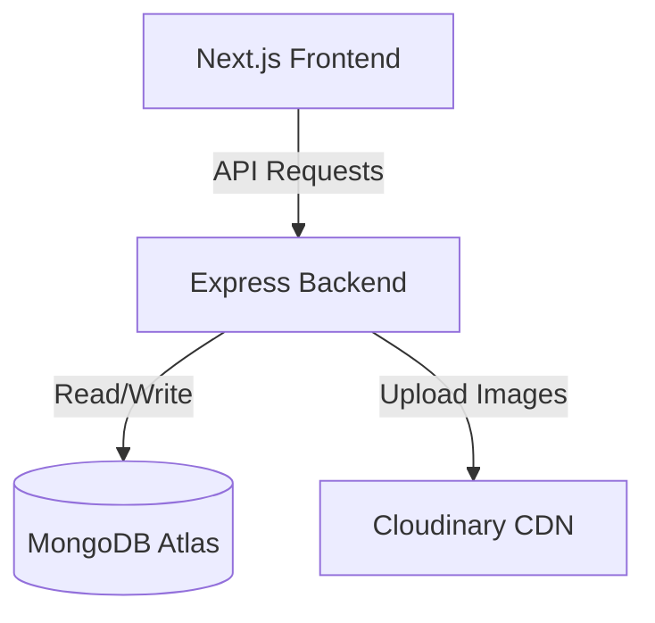

# Deployment & Hosting Guide

This guide explains how to make this E-Commerce Store live. The application contains a **Next.js frontend** and an **Express/Node.js backend** with a **MongoDB database**.

---

## Architecture Overview

- **Frontend**: Next.js hosted on **Vercel** (recommended, free, and optimized for Next.js).
- **Backend**: Express.js server hosted on **Render** or **Railway** (free/cheap tier available).
- **Database**: MongoDB hosted on **MongoDB Atlas** (free tier cluster).
- **Media Storage**: Cloudinary (optional, for hosting product images).

---

## Step 1: Database Setup (MongoDB Atlas)

1. Go to [MongoDB Atlas](https://www.mongodb.com/cloud/atlas) and sign up for a free account.
2. Create a **New Cluster** using the **Shared (Free)** tier. Select a cloud provider (e.g., AWS) and region nearest to you.
3. Once the cluster is created, go to **Database Access** under Security:
   - Click **Add New Database User**.
   - Set a username and a strong password (copy the password).
4. Go to **Network Access** under Security:
   - Click **Add IP Address**.
   - Select **Allow Access From Anywhere (0.0.0.0/0)** so your backend hosting service can connect to it.
5. Go to the **Clusters** dashboard and click **Connect**:
   - Choose **Connect your application**.
   - Copy the connection string. It will look like this:
     `mongodb+srv://<username>:<password>@cluster0.xxxxxx.mongodb.net/?retryWrites=true&w=majority`
   - Replace `<password>` with the password you created.

---

## Step 2: Backend Deployment (Render)

Render is a popular platform to host Node.js servers for free.

1. Sign up/log in at [Render](https://render.com/).
2. Click **New +** and select **Web Service**.
3. Connect your GitHub account and select your `ecommerce-website` repository.
4. Configure the Web Service settings:
   - **Name**: `ecommerce-backend` (or similar)
   - **Root Directory**: `backend`
   - **Language**: `Node`
   - **Build Command**: `npm install`
   - **Start Command**: `node server.js`
5. Scroll down to **Environment Variables** (or click **Advanced** -> **Add Environment Variable**) and add the following:
   - `MONGO_URI`: `mongodb+srv://<username>:<password>@cluster0.xxxxxx.mongodb.net/customprint?retryWrites=true&w=majority` (Replace with your Atlas connection string)
   - `JWT_SECRET`: `your_random_jwt_secret_string` (Create a long random string)
   - `PORT`: `5000` (Render binds its own PORT automatically, but setting this is a good practice)
   - `EMAIL_USER`: `your-email@example.com` (If sending emails)
   - `EMAIL_PASS`: `your-app-password`
   - `CLOUDINARY_CLOUD_NAME`: `your-cloudinary-name` (If storing custom print designs)
   - `CLOUDINARY_API_KEY`: `your-cloudinary-key`
   - `CLOUDINARY_API_SECRET`: `your-cloudinary-secret`
6. Click **Create Web Service**. Wait for the build and deployment logs to say "Live".
7. **Copy your backend service URL** (e.g., `https://ecommerce-backend.onrender.com`).

---

## Step 3: Frontend Deployment (Vercel)

Vercel is the creator of Next.js and provides the fastest, most reliable hosting for it.

1. Log in to [Vercel](https://vercel.com/) (select log in with GitHub for automatic repository access).
2. Click **Add New...** and select **Project**.
3. Import your `ecommerce-website` repository from the list.
4. Configure the Project settings:
   - **Framework Preset**: `Next.js`
   - **Root Directory**: Click Edit, select the `frontend` folder, and click Continue.
5. Open the **Environment Variables** section and add the following:
   - Key: `NEXT_PUBLIC_API_URL`
   - Value: `https://your-backend.onrender.com/api` (Replace with your Render backend URL, appending `/api` at the end)
6. Click **Deploy**.
7. Once deployed, Vercel will give you a live production URL (e.g., `https://ecommerce-website.vercel.app`).

---

## Step 4: Final Verification

1. Visit your live Vercel URL.
2. Test registering/logging in, viewing products, and attempting custom order options.
3. Check the developer console if API requests are failing. Ensure the `NEXT_PUBLIC_API_URL` environment variable matches your hosted backend service URL perfectly and has `/api` at the end.
